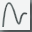

# Description

This is yet another molecule editor. It is platform-independent, and runs in a web browser. The project is focused on 
convenient drawing of publication quality structures, paying great attention to aesthetics. A nice looking structure 
is achieved by the comprehensive logic behind atom and bond auto positioning, alignments and shape computations.

# Browser compatibility
Tested on **Google Chrome** and **Mozilla Firefox**.

# Run
The app is hosted on GitHub pages: [CSE](https://sergiidudkin.github.io/ChemicalStructureEditor/).
Alternatively, you can run it locally. Clone the repository, or download it as archive and unzip. After that run the 
`src` directory with a local server, e.g. __live-server__:
1. Install __Node.js__ and __npm__ if not installed.
2. Install __live-server__: `npm install -g live-server` if not installed.
3. Go to the `src` directory in your console or terminal.
4. Run `live-server` or `npx live-server`. The app will be opened automatically in your default browser.

#  Selection dropdown menu 
The menu contains a set of tools to select whole molecules or their specific parts. Every selection is marked with blue
outline, augmented with the transform tool:

The selection can be moved to any direction. Just click on the selection, drag and drop. If the selection is pulled by
some atom (i.e. the cursor is over the atom) while the `Shift` key is pressed, gets sticky, and can be merged with 
another, static atom. In other words, two molecules can be merged. If the static and dragged atoms have different 
symbol, the static atom or group has precedence.

## Transform tool
The transform tool consists of the circle, 8 corner squares, 8 side rectangles, and the cross-like pivot (see the 
[figure](assets/images/transform_tool.png) above).

### Rotating
Click on the circle , drag and drop. The selection will follow the direction of the cursor. If the 
`Shift` key is pressed, the rotation angle is forced to be discrete with 5 ° resolution.

### Scaling
Click on any corner square , drag and drop. Approaching the pivot results in scale-down, and vice 
versa. If the `Shift` key is pressed, the scaling coefficient is forced to be discrete with 5 % resolution.

### Stretching
Click on vertical  or horizontal  side rectangle (vertical or 
horizontal stretching respectively), drag and drop. Approaching the pivot leads compression, and vice versa. If the 
`Shift` key is pressed, the stretching coefficient is forced to be discrete with 5 % resolution.

### Pivot
The pivot  defines the point of space that stays steady during any affine transform 
except translation. To move the pivot, click on it, drag and drop. If the `Shift` key is pressed, the pivot sticks to 
atoms and bonds, so the transform operation can be executed precisely around the certain element.

## Hotkeys
* Copy: `Ctrl + C`
* Paste: `Ctrl + V`
* Cut: `Ctrl + X`
* Delete: `Ctrl + Del` or `Ctrl + Bksp`

##  Rectangle 
The tool selects atoms and bonds within a rectangular area. To specify this area, click on mouse left button, drag and 
drop. Clicking on atom or bond allows dragging and dropping only this element without selecting it.

##  Lasso
The tool selects atoms and bonds within an arbitrary shaped area. To specify this area, click on mouse left button, lead 
around and drop. Clicking on atom or bond allows dragging and dropping only this element without selecting it.

##  Molecule
The tool selects the entire molecule. Just click on any atom or bond of the molecule.

#  Atom dropdown menu 
The atom menu contains the five most frequently used elements:

 
 
 

In general, clicking some atoms leads to setting the corresponding chemical element, augmented by hydrogens to fill up 
the remaining valencies. If the same element is already set,
then it turns into implicit carbon (no chemical symbol, and no adjacent hydrogens displayed). If any atom or group
is clicked, and 
the cursor is dragged, the atom symbol is not changed. Instead, an extra group is appended, e.g. SH, H, CH3.

If blank space is clicked,
it sets the corresponding hydride, e.g. CH4, NH3. Clicking on blank space and dragging attaches
the second group to the first one, so the molecules like H2O2 and N2H4 can
be drawn in one go. If a standalone chemical group is clicked with the corresponding tool (for example, you selected 
__N__ tool, and clicked on NH3), the molecule will be deleted. In other words, in the specific case the tool
acts like an eraser.

#  Bond dropdown menu 

##  Single bond 
The single bond tool is used to build the basic carbon sceleton. Click on the blank space or some atom, and drag the 
bond to desired direction. If the cursor eventually hits another atom regardless how far it is, the bond end will stick 
to it. Repeatedly clicking on the existing bond leads to the following bond type circulation:

single bond ⮕ double bond ⮕ triple bond ⮕ single bond

##  Double bond 
It is possible to draw new double bonds using this tool, however the main purpose of it is to change subtype of the
double bond. It is especially useful, if the default double bond behavior makes unwanted constrains for user, so the 
problem can
be easily fixed manually. Repeatedly clicking on the existing bond leads to the following bond type circulation:

auto shift ⮕ left-shifted ⮕ centered ⮕ right-shifted ⮕ auto shift

##  Upper bond 
This tool is used to draw or set directly wedged upper bond, or change the upper bond subtype. Repeatedly clicking on 
the existing bond leads to the following bond type circulation:

directly wedged upper ⮕ unwedged upper ⮕ reversed wedged upper ⮕ directly wedged upper

##  Lower bond 
This tool is used to draw or set directly wedged lower bond, or change the lower bond subtype. Repeatedly clicking on 
the existing bond leads to the following bond type circulation:

directly wedged lower ⮕ unwedged lower ⮕ reversed wedged lower ⮕ directly wedged lower

#  Eraser 
It deletes atoms and bonds. If some atom is deleted, its bonds are deleted automatically. If all bonds of the implicit 
carbon are deleted, the latter is displayed as CH4.

#  Atom text 
This tool allows to set arbitraty text of the chemical node. It can be not any atom, but also a functional group. If the
named functional group is from the list (Me, Et, Pr, Bu, Ph, Bn, Ac, Bz, Ts), it will be chemically parsed correctly. 
The same is valid for any combination of atoms, named groups, brackets and subscript indices. By now, the list of named 
groups can be extended only programmatically, but the corresponding IU feature is planned.

#  Carbocycle dropdown menu 
The carbocycle menu contains the five most frequently used cycles:

Carbocycles can be stacked by corners or by edges. To stack by corner, select the desired carbocycle from the dropdown 
menu, then click on some already existing atom and drag to certain direction to specify the angle. The cycle will follow 
the cursor. After that release the left mouse button. To stack by edge, click on some bond and drag the cursor towards
the side where the cycle should be placed. Notice that the carbocycle atoms are sticky while drawing. It means that if 
its atom overlaps or very close to an already existing one, they will be merged. Multiple benzene rings can be fused as 
well.

#  Arrows dropdown menu 
The arrow menu contains the four most frequently used arrows:

Reaction, equilibrium, resonance and retro reaction arrow respectively. Press the left mouse button to start drawing, 
drug and release to finish. Position, length and direction of an arrow can be adjusted by dragging and dropping of 
control points.

#  Shapes dropdown menu 
The shape menu contains the seven most frequently used shapes:

Line, circle, rectangle, polyline, polygon curve and smooth shape respectively. To draw line, circle or rectangle, 
press the left mouse button to start drawing, drug and release to finish. To draw polyline, polygon curve or smooth 
shape, click multiple times on the canvas to set control points. Press `Tab` key to finish the current shape. Polyline and 
polygon require at least two control points; curve and smooth shape require at least three control points. Control 
points define the appearance of shape. Each shape can be modified by dragging and dropping the control points. Curves 
and smooth shapes are inscribed into the corresponding polylines and polygons defined by control points. Additional 
control points define the points of tangency. Circles cannot be stretched. Rectangles can be stretched in the 
directions parallel to their edges. 

# Undo, redo
The app fully supports this functionality. Use `Ctrl + Z` and `Ctrl + Y` (or `Ctrl + Shift + Z`) for undo and redo 
respectively.

#  File menu
## New
Deletes all drawings on canvas.

## Save as .svg
Saves the image in SVG format.

## Save as .json
Saves the drawings in the custom JSON format. Later the file can be opened by this app.

## Open .json file
Open previously saved JSON file.

# MacOS
Please use `Cmd` key instead of `Ctrl`.

# Roadmap
* Adjustable canvas and zooming
* Text and its formatting
* Charges and radicals
* Templates, including the custom ones
* Molecule style menu (font, color bond thickness, etc.)
* Image metadata for SVG images to store the molecular graph and style info
* Proper clipboard support

# References
[Graphical Representation of Stereochemical Configuration (IUPAC Recommendations 2006)
](https://iupac.qmul.ac.uk/drawing/stereo.html)